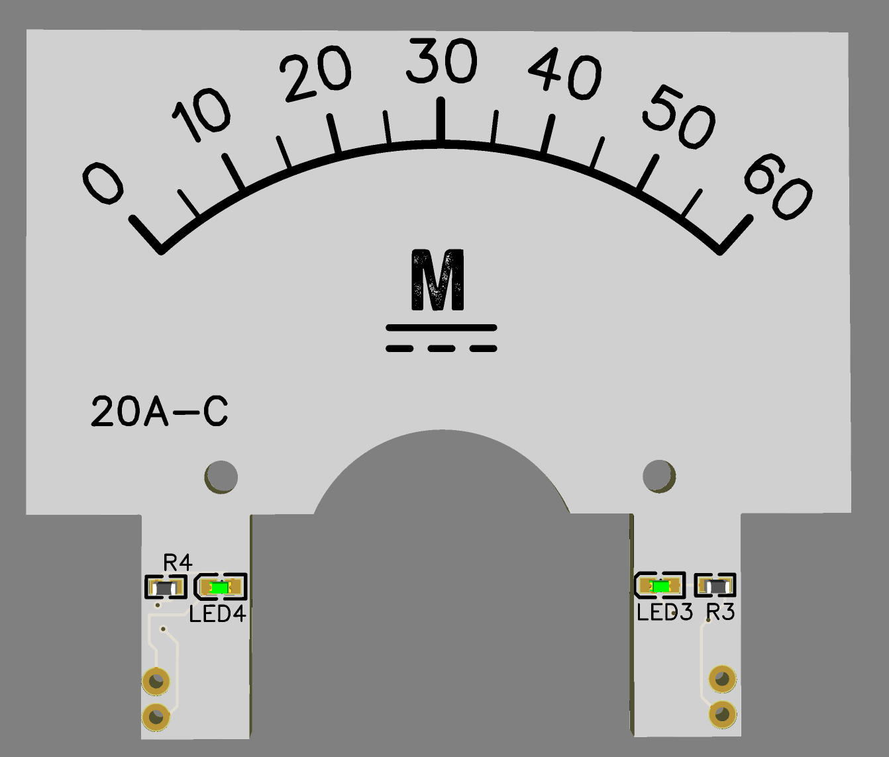
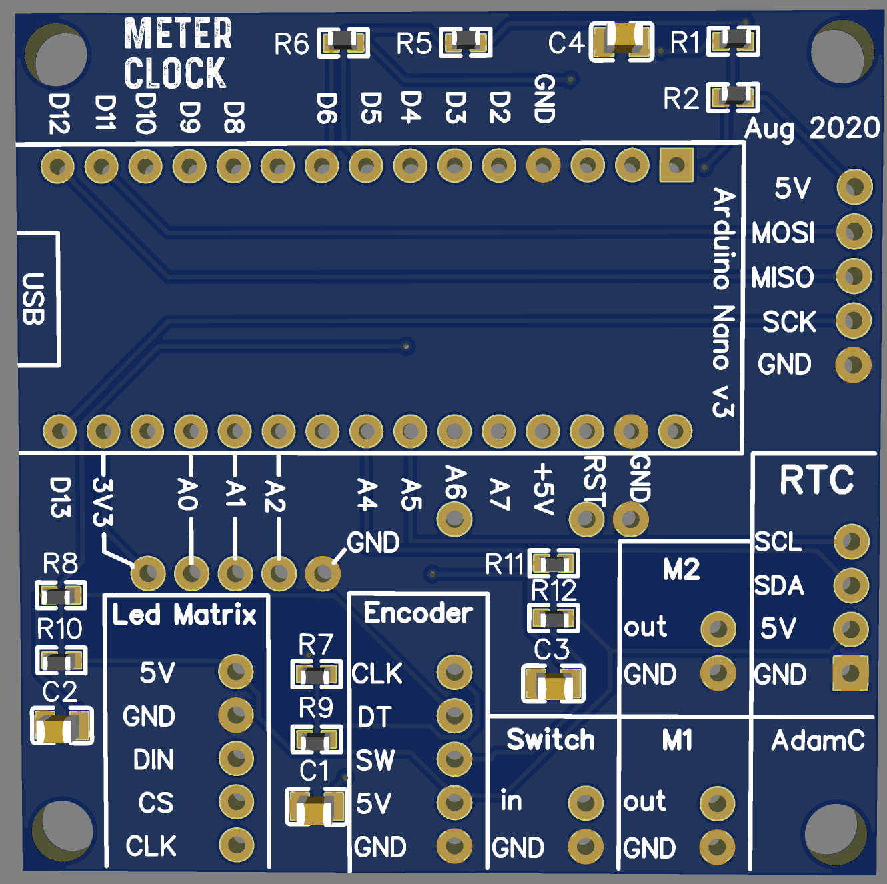

# MeterClock

A clock displaying hour and minutes on two analog meters. Powered by Arduino and an RTC.

Insides of Meter Clock with room for Arduino Nano, DS3231 module, connectors for LED matrix 32x8 using MAX7221 and debouncing connection for two switches and one encoder.

## Parts List

+ Bamboo/Timber box without lid
+ Ardunino Nano (ATMega168)
+ milliamp meters x2
+ LED matrix modile 32 by 8 (4 module 8x8 LED matrix powered by MAX7221)
+ DS3231 module
+ PCB front panel
+ PCB inner meter panel x2 (one for hours, one for minutes)
+ Functional PCB
+ Push button
+ Rotary Encoder
+ .

### Tools Required

+ Soldering Iron
+ Solder
+ Saw for cutting timber
+ Screwdrivers
+ Hot Glue Gun

## Design

I wanted the overall product to have a retro vibe to provide some symmetry with the meters. I chose a bamboo housing (which isn't exactly retro - maybe wood panelling would be more so - but is readily available in many discount thrift shops near me). So with the outer material chosen I then needed to think about the front panelling. I took the decision early on to use EasyEDA as the schematic design tool and JLCPCB as the manufacturer. As part of that approach I decided to make the front panel out of a PCB. This could be made on a 3D printer instead. The inner panels, those that sit inside the meters, are also made from a white PCB with black lattering. I do like the precision of the white PCB. Alternatively these could be made with paper and produced on a standard laser printer and cut to fit. 

One of the use cases I had for the clock is to softly alert me every hour and half hour during the day. This is my cue that I might have to join a meeting or otherwise check my schedule. The code turns the LED matrix on each half hour during daytime. 

### Power

Power for the device is 5V from the micro-USB connector extent on the Ardunio Nano module. This also serves as the programming port for updating the code. The board was oriented so that the micro USB was accessible from the rear of the encolsure. 

### Interface

The rotary control is used for changing date and time. I chose this interface method since it is much smoother and nicer than clicking buttons and in my opinion more intuitive. The code isnt that much more complex and I'd argue that the physcial build is simplified since one physcial encoder provides three inputs: up, down and click. The encoder has another advantage in mounting location. If you put buttons on the side of a device you need to hold the top of the device while pressing the buttons otherwise the device slips around. In practice this means using your other hand or using the thumb to hold it down while the fingers do the clicking. The one button I put on the device i mounted towards the top on the back panel. For usage you would look at the front of the device and then put your hand over the top and with your palm resting on the device click / hold the button down to enter the mode for setting the time and date.

Using 7H by 5W characters the 32x8 LED matrix provides enough space for the display for 5 characters at a time. This is sufficient for year, date and time. I originally intended to have animated use of the matrix (scrolling) but the max storage space of the ATMega168 was full.

### Improvements

I hit the limits of functionality that I could pack inside of the Arduino Nano ( an ATMega168 with 16k storage). With two buttons and a rotary dial plus the outputs of the 32x8 matrix and the two analgoue meters there is a fair bit more functionality I wanted to write but simply ran out of bytes of storage in the Arduino Nano to do so. Any improvements should look at using a controller with more storage space. 

## Software

### Library List

+ [Notched Shaft Encoder v1.0.0](https://github.com/lesterlo/Notched-Shaft-Encoder) - Monitor the postion and clickable button status from a notched shaft encoder
+ [RTCLib by NeiroNx v1.6] (https://github.com/NeiroNx/RTCLib) - A library that makes interfacing DS1302, DS1307, DS3231, PCF8583, PCF8563, RTC_Millis Real Time Clock modules easy.
+ [AceButton v1.6.1](https://github.com/bxparks/AceButton) - An adjustable, compact, event-driven button library that handles debouncing and dispatches events to a user-defined event handler.

## As-Built

### External

### PCB Inside Meter

MeterClockInner - The inside of the analogue meters that shows graduations from 0 to 12 for hours and on the reverse side, from 0 to 60 for minutes.

+ [oshwlab MeterClockInner](https://oshwlab.com/adamc/meterclockinner)
+ [EasyEDA MeterClockInner](https://easyeda.com/editor#id=60065c9caff1483fb72fd92636a5c24b)

### PCB Front Face

This is the PCB inside of the meter clock. It has a spot to mount the Arduino Nano and the RTC. The remainder of the board has connectors to the display (led matrix) and the RC filtered inputs (encoder and push button). 

